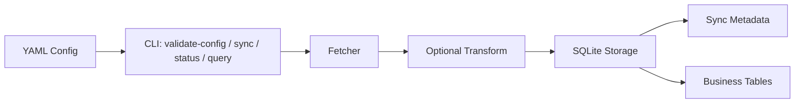

# api-sync-pipeline

Configurable REST API to SQLite sync starter for customer-facing data ingestion projects.

This repository is built to demonstrate the service I would deliver for a B2B client: define the request contract in YAML, sync API data into SQLite with idempotent upserts, and give operators a simple CLI for validation, execution, and inspection.

## What Problem This Solves

Many teams need a lightweight sync job before they need a full data platform. Typical cases:

- pulling orders, tickets, or accounts from a vendor API into a local operational store
- validating an integration contract before building a larger pipeline
- shipping a client-specific sync service with minimal deployment friction
- giving operations teams a repeatable job they can run and inspect locally

This project shows that flow end to end.

## What This Repo Demonstrates

- explicit request contracts via YAML instead of code edits
- real primary-key upserts keyed by the configured `id_field`
- adaptive schema evolution as new fields appear in payloads
- incremental sync support with configurable `since` semantics
- CLI commands for config validation, sync execution, status inspection, and row preview
- local and Docker demo paths
- tests, linting, and CI suitable for a small delivery starter

## What I Would Tailor Per Client

- authentication scheme and secret handling
- pagination and cursor conventions
- field-level transforms and normalization rules
- scheduling and runtime environment
- destination database and deployment platform
- monitoring, alerting, and retention policy

## Quick Start

### Local CLI

```bash
python -m venv .venv
source .venv/bin/activate
pip install -e ".[dev]"

api-sync validate-config --config examples/customer_orders.yaml
api-sync sync --config examples/jsonplaceholder_posts.yaml --db demo/public-demo.db
api-sync status --db demo/public-demo.db
api-sync query --db demo/public-demo.db --table posts --format table
```

### Docker Demo

```bash
make install
make demo-build
make demo-run
```

Secrets are read from environment variables. Copy values from [.env.example](/Users/ignaziodesantis/Desktop/Development/portfolio-projects/api-sync-pipeline/.env.example) into your shell or your real deployment secret store.
Use [examples/jsonplaceholder_posts.yaml](/Users/ignaziodesantis/Desktop/Development/portfolio-projects/api-sync-pipeline/examples/jsonplaceholder_posts.yaml) for a live public demo and [examples/customer_orders.yaml](/Users/ignaziodesantis/Desktop/Development/portfolio-projects/api-sync-pipeline/examples/customer_orders.yaml) to show how a customer-specific contract would be configured.

## Configuration Model

Core YAML fields:

- `name`, `base_url`, `endpoint`, `table`
- `id_field`, `cursor_field`, `page_size`, `timeout`
- `request_headers`, `request_params`
- `pagination_mode`: `auto | offset | cursor | none`
- `records_path`, `next_cursor_path`
- `page_param`, `page_size_param`, `cursor_param`
- `since_param`, `since_value_mode`

Example customer-style config:

```yaml
name: customer_orders
base_url: https://api.customer-example.com
endpoint: /v1/orders
table: customer_orders
id_field: order_id
cursor_field: updated_at
page_size: 100
timeout: 20
pagination_mode: offset
page_param: page
page_size_param: page_size
since_param: updated_at
since_value_mode: gte_suffix
records_path: data.orders
request_headers:
  Authorization: "Bearer ${CUSTOMER_API_TOKEN}"
  X-Customer-Region: "${CUSTOMER_REGION}"
request_params:
  status: active
```

See [examples/customer_orders.yaml](/Users/ignaziodesantis/Desktop/Development/portfolio-projects/api-sync-pipeline/examples/customer_orders.yaml) for the tracked example.

## CLI Commands

```bash
api-sync validate-config --config examples/customer_orders.yaml
api-sync sync --config examples/customer_orders.yaml --db sync.db
api-sync status --db sync.db
api-sync query --db sync.db --table customer_orders --limit 20 --format json
api-sync query --db sync.db --table customer_orders --limit 20 --format table
```

CLI behavior:

- validation failures return a non-zero exit with a concise config error
- storage failures return a non-zero exit with a concise storage error
- sync failures from the source API return a non-zero exit with a concise fetch summary
- normal usage does not print Python stack traces

## Demo Assets

The [demo](/Users/ignaziodesantis/Desktop/Development/portfolio-projects/api-sync-pipeline/demo) folder includes:

- [expected_sync_output.json](/Users/ignaziodesantis/Desktop/Development/portfolio-projects/api-sync-pipeline/demo/expected_sync_output.json)
- [expected_status_output.txt](/Users/ignaziodesantis/Desktop/Development/portfolio-projects/api-sync-pipeline/demo/expected_status_output.txt)
- [expected_query_output.txt](/Users/ignaziodesantis/Desktop/Development/portfolio-projects/api-sync-pipeline/demo/expected_query_output.txt)
- [WALKTHROUGH.md](/Users/ignaziodesantis/Desktop/Development/portfolio-projects/api-sync-pipeline/demo/WALKTHROUGH.md)

These are meant to support a short buyer conversation or live technical demo.

## Architecture



Project layout:

```text
api_sync/
  config.py      # YAML loading, env interpolation, validation
  fetcher.py     # Configurable request building + pagination
  pipeline.py    # Fetch -> transform -> store orchestration
  storage.py     # SQLite upserts, schema evolution, status tracking
main.py          # CLI entrypoint
examples/        # Public examples + customer-style config
demo/            # Buyer-facing sample outputs and walkthrough
.github/         # CI workflow
Dockerfile       # Containerized demo path
Makefile         # Local install/test/lint/demo helpers
```

## Limitations and Extension Points

This repo is intentionally a compact starter, not a full ingestion platform.

Current boundaries:

- SQLite is the only built-in destination
- request retries are simple exponential backoff
- transforms are code-based, not a declarative mapping engine
- auth refresh flows and webhook/event ingestion are not built in
- scheduling is left to the runtime environment

Natural next extensions for a client delivery:

- Postgres or warehouse destinations
- per-source transform modules and validation rules
- metrics, alerting, and structured sync logs
- cron/container deployment or managed job scheduling
- richer API auth flows such as OAuth refresh

## Quality Signals

- `41` passing tests covering config validation, fetch behavior, storage behavior, CLI behavior, and pipeline flows
- `ruff` lint configuration
- GitHub Actions CI that runs lint, tests, and Docker build
- Dockerfile for a zero-setup demo

Run locally:

```bash
make lint
make test
```

## Why This Is Buyer-Ready

- The integration contract is explicit and reviewable.
- The repo demonstrates how a client API can be onboarded without rewriting application code.
- Operators get a usable CLI, not just a library.
- The documentation is honest about scope while making the extension path obvious.
- The packaging and proof assets are good enough for evaluation, not only for local development.
